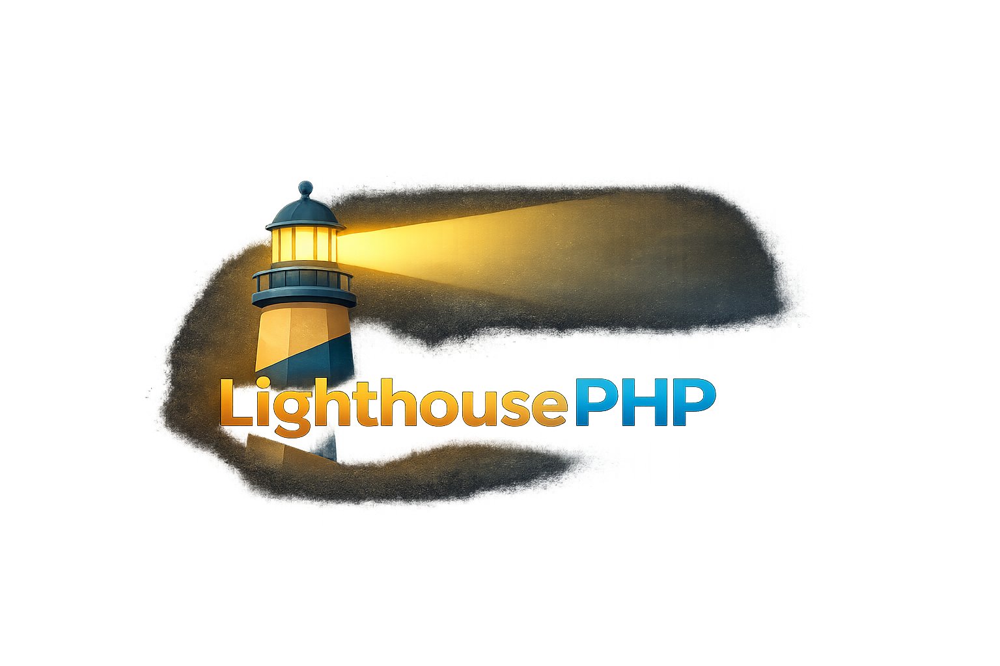

# LighthousePHP



## Introduction

LighthousePHP is a procedural PHP framework focused on simplicity, speed, and a zero-dependency runtime. It uses file-based routing, native PHP templates, raw SQL migrations, and a lightweight built-in CLI so small applications can stay easy to understand and quick to ship.

## Install

Install the latest release globally:

```sh
curl -fsSL https://raw.githubusercontent.com/maxbertinetti/LighthousePHP/main/install.sh | sh -s -- maxbertinetti/LighthousePHP
```

Install a specific release tag or version:

```sh
curl -fsSL https://raw.githubusercontent.com/maxbertinetti/LighthousePHP/main/install.sh | sh -s -- maxbertinetti/LighthousePHP tag:0.1.0
```

Install a branch snapshot explicitly:

```sh
curl -fsSL https://raw.githubusercontent.com/maxbertinetti/LighthousePHP/main/install.sh | sh -s -- maxbertinetti/LighthousePHP branch:main
```

Create a new project after installing:

```sh
lighthouse new my-app
cd my-app
lighthouse serve
```
