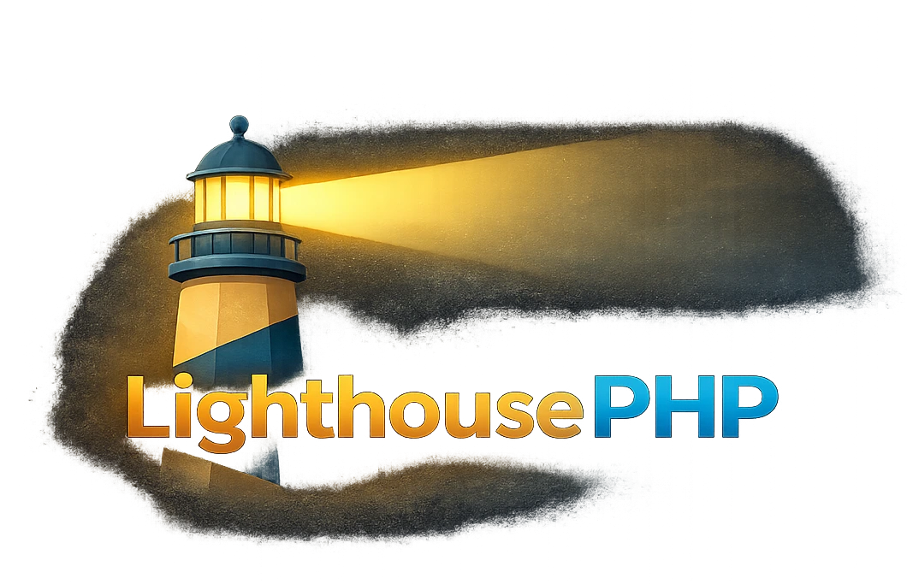

{ width="800" }

**LighthousePHP** tries to be an easy way to create most websites and apps,
whether you're new to web programming or a veteran.

The way **LighthousePHP** was conceived is the way PHP was once used — before
MVC frameworks, the cloud, AI... Don't worry! This isn't a nostalgic trip to
the past!

## Goals

**LighthousePHP** is a procedural PHP framework — zero OOP, no Composer
dependencies — built around file-based routing. Its goals are simple:

- **Performance, security and SEO out of the box** — targeting 100/100 on
  Google Lighthouse under correct usage.
- **No magic, no surprises** — understand web standards and know your tools.
- **Sensible defaults for every layer** — backend, frontend and styles, all
  covered.

To keep things consistent and avoid fragmented knowledge, **LighthousePHP**
ships with a single CSS mini-framework inspired by PicoCSS (`default.css`) and
a lightweight HTMX-based interaction layer (`default.js`). One tool to learn,
zero integration headaches.

If what you've read makes you at least a little curious — continue this
journey. You won't regret it!

> Max Bertinetti
>
> *LighthousePHP creator*
